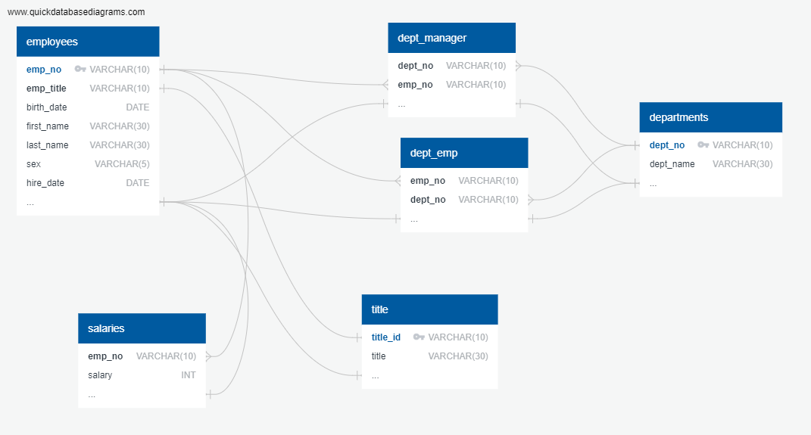

# sql-challenge
This challenge has two components:
1. Creating a <b>Postgres database</b>
2. Querying the database using <b>SQL</b> (<b>S</b>tructured <b>Q</b>uery <b>L</b>anguage)

### 1. Creating a Postgres database

 
6 CSV files were provided containing a company's employee information.
 
The information includes:

- Employee Number
- Department Number
- Job Title
- Department Manager
- Salary

 
Using pgAdmin 4 as the management tool, I created six tables in the database that correspond to the six CSV files. A schema was created using an <b>ERD</b> (<b>E</b>ntity <b>R</b>elation <b>D</b>iagram) in order to create proper relationships between database tables.

 
 ### 2. Querying the database using SQL
 
  
 With the Postgres database created, I queried for various information.
  
  
 An example SQL query below:
  
 
 	-- List Sales and Development department employees: employee no., last name, first name, department name
	
	-- Sales department no. = 'd007' , Development department no. = 'd005'
 	SELECT E.emp_no AS employee_number, E.last_name, E.first_name
	, D.dept_name AS department_name
	FROM employees AS E
	INNER JOIN
	
	-- Use 'UNION' operator to combine 'dept_emp' and 'dept_manager' tables
	(
		SELECT DE.emp_no, DE.dept_no
			FROM dept_emp AS DE
				WHERE dept_no
				IN ('d007', 'd005')
		UNION
		SELECT DM.emp_no, DM.dept_no 
			FROM dept_manager AS DM
				WHERE dept_no
				IN ('d007', 'd005')
		) UD
		USING(emp_no)
		LEFT JOIN departments AS D
			USING(dept_no)
				WHERE dept_no 
				IN ('d007', 'd005')
	ORDER BY last_name, first_name
	;

 
Each SQL query is saved as an SQL file.
 
The ERD is saved as a PNG file.
